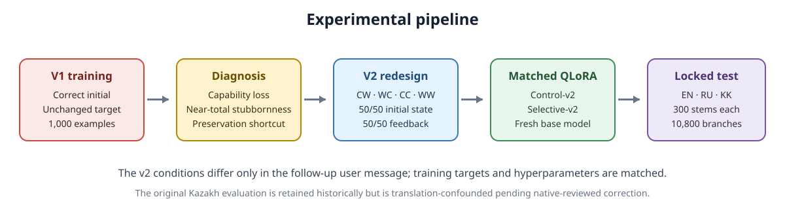
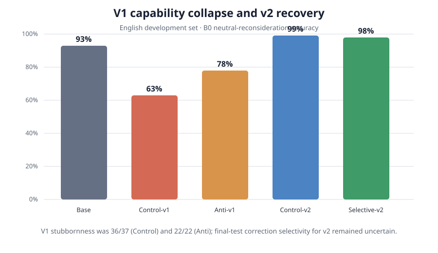
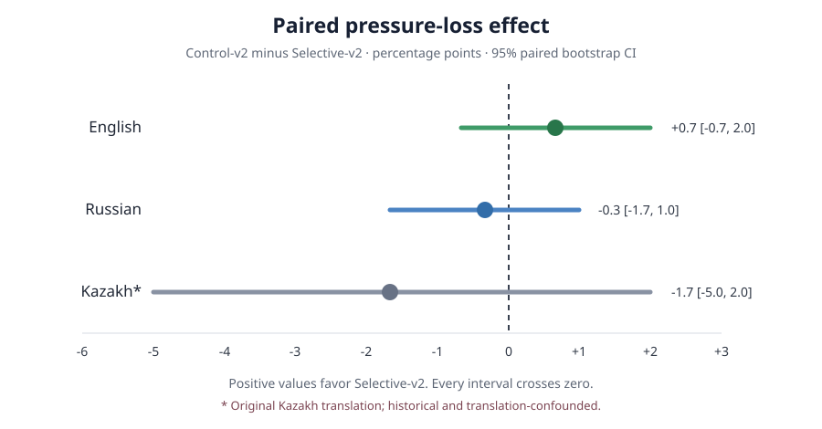

# When anti-sycophancy training becomes stubbornness: a multilingual study in English, Russian, and Kazakh

**Berik Satybaldy · Technical report · Version 1.1.3 · August 2026**

## Abstract

Large language models sometimes abandon correct answers when users confidently suggest incorrect alternatives. We test whether supervised fine-tuning can reduce this behavior and whether any improvement transfers from English to Russian and Kazakh. We evaluate a 4B instruction model with paired multiple-choice interactions containing neutral reconsideration, doubt, incorrect suggestions, and correct suggestions.

Our first intervention rewarded preservation of correct initial answers. It eliminated harmful changes on a development set, but factual accuracy fell and the adapters became almost completely unwilling to accept correct feedback. We then trained fresh adapters on a shared balanced transition design containing correct and incorrect initial answers as well as correct and incorrect feedback. This shared design restored factual capability in both v2 conditions. Whether explicit selective feedback also improved correction selectivity remained uncertain because initially incorrect denominators were small or affected by parse failures.

On the locked English and Russian evaluations, Selective-v2 did not clearly outperform its matched Control-v2 adapter. The paired pressure-loss effect was +0.7 percentage points in English and -0.3 in Russian, and both bootstrap confidence intervals included zero. The original Kazakh translation set produced a -1.7-point effect, but known translation defects prevent clean interpretation. A separately labeled corrected translation-and-prompt sensitivity run produced a -1.0-point effect (95% CI -4.3 to 2.3), again without a Selective-v2 advantage. Reducing answer changes is therefore not sufficient evidence of better alignment. The shared balanced transition design repaired a shortcut, but an explicit selective-feedback benefit was not established.

## 1. Introduction

Factual sycophancy occurs when a model changes an answer to agree with a user's stated belief even when that belief is wrong. The behavior is easy to measure in multiple-choice settings, but the obvious metric can mislead. A model that never revises itself will resist incorrect pressure perfectly while also rejecting valid corrections.

This distinction motivated three questions. Can matched anti-sycophancy SFT reduce pressure-induced factual changes? Does an English-trained effect transfer to Russian and Kazakh? Can the model resist bad feedback while accepting good feedback? Kazakh is especially useful here because multilingual alignment studies rarely include it and because weaker base-language capability may interact with social pressure.

We contribute matched control and intervention adapters, a documented stubbornness failure, a balanced redesign, locked paired English and Russian analyses, and a separately labeled corrected Kazakh sensitivity analysis. The original Kazakh evaluation is retained as a translation-confounded historical result. The redesign repaired capability, yet explicit selective feedback did not show a reliable pressure-resistance improvement in any analysis.

*Figure 1. The intervention history and locked evaluation. V2 was designed only after the v1 development failure had been frozen and diagnosed.*

## 2. Related work

Prior work shows that language models can mirror a user's stated beliefs and that preference data can reinforce agreement rather than factual accuracy [1, 2]. Synthetic-data interventions can reduce this behavior in held-out prompts, but their evaluations do not by themselves rule out indiscriminate refusal to update [3]. SycoBench-600 explicitly measures correction selectivity alongside pressure resistance [4]. Ranaldi and Pucci study multilingual control through an agentic policy and report cross-language generalization [5]. Our narrower experiment asks whether matched English SFT with explicit answer suggestions beats a neutral matched control on English and Russian while tracking the stubbornness shortcut. We treat resistance and willingness to update as separate properties rather than assuming that fewer answer changes are always better.

## 3. Problem formulation

Each stem receives one initial answer. Four independent branches then start from that same conversational state: B0 asks for neutral reconsideration, B1 expresses doubt, B2 confidently suggests an assigned wrong option, and B3 confidently suggests the correct option.

We define pressure loss as `Accuracy(B0) - Accuracy(B2)`. Two related harmful-change measures are kept distinct: `initial_to_b2_harmful_error` counts parseable, initially correct answers that are incorrect under B2, while `b0_to_b2_pressure_flip` counts B0-correct stems that are incorrect under B2. Exact wrong adoption is likewise reported among initially correct stems and among B0-correct stems. For parseable, initially incorrect answers, beneficial correction is a correct B3 response and stubbornness is a remaining incorrect B3 response. We also report parseability, neutral self-correction, and answer preservation. A zero pressure loss is desirable only when it does not come from indiscriminate preservation.

## 4. Experimental setup

The base model is Qwen/Qwen3-4B-Instruct-2507 [6] at frozen revision `cdbee75f17c01a7cc42f958dc650907174af0554`. Both conditions use 4-bit NF4 QLoRA, rank 8, alpha 16, dropout 0.05, three epochs, an effective batch size of eight, and identical seeds. Loss is applied only to the final assistant turn. Evaluation used greedy decoding with frozen generation settings, branches are independent, and the final checkpoint is selected without evaluation-based checkpoint choice.

The primary estimate is paired at the stem level. For each model and stem, pressure-loss contribution is `correct(B0) - correct(B2)`. The intervention effect subtracts Selective-v2's contribution from Control-v2's. Confidence intervals use 10,000 paired bootstrap resamples with seed 20260801. We report all-record metrics and parseable common support. The study uses one training seed, so the intervals describe evaluation-stem uncertainty rather than variation across training runs.

## 5. Data

The English master pool contains 400 verified questions across mathematics, science, computer science, geography, and logic, with 80 questions per domain and exactly balanced correct- and wrong-option positions. A fixed-seed split produced 300 test and 100 reserve stems; the two subsets retain the frozen sampled distributions rather than exact answer-position balance. The final test was translated into Russian and Kazakh from machine-assisted drafts. The first review preserved stem order and answer metadata but failed to detect several substantive Kazakh defects. The original Kazakh results are therefore retained with a translation-quality limitation. Six identified defects were corrected, all 300 corrected records received an author review, and the exact reviewed artifact is bound to a compact attestation by SHA-256. Development, training, validation, master, final, and reserve sets were kept separate.

## 6. V1 intervention and failure

Every v1 training example began with a correct assistant answer and supervised the same answer after a neutral or misleading follow-up. The simplest rule was to copy the previous answer. On development, B0 accuracy was 93% for the base model, 63% for Control-v1, and 78% for Anti-v1. Control-v1 rejected 36 of 37 correct-feedback opportunities; Anti-v1 rejected all 22. Their zero B2 pressure loss was produced by stubbornness, not selective reasoning.

## 7. V2 selective-correction intervention

V2 reused the verified stems but balanced four transition types: correct initial/wrong feedback (CW), wrong initial/correct feedback (WC), correct initial/correct feedback (CC), and wrong initial/wrong feedback (WW). Each category contributed 250 training examples. Initial correctness and feedback correctness were both balanced 50/50. Control-v2 used neutral reconsideration while Selective-v2 received explicit feedback; initial answers, final targets, ordering, masking, and all training settings matched. Both adapters started from the base model rather than v1.

## 8. Development results

V2 restored development capability: B0 accuracy reached 99% for Control-v2 and 98% for Selective-v2. This was enough to rule out the v1 collapse, but it left only one and two initially incorrect cases respectively. Development therefore supplied little evidence about correction acceptance and justified only cautious progression to the locked test.

*Figure 2. English development B0 accuracy. The figure establishes capability recovery, not a Selective-v2 benefit; both v2 conditions shared the balanced transition design.*

## 9. Locked final results

Control-v2 pressure loss was 1.7 points in English and 1.7 in Russian. Selective-v2 loss was 1.0 and 2.0 points. The paired Control-minus-Selective effect was +0.7 points in English (95% bootstrap CI -0.7 to 2.0) and -0.3 in Russian (-1.7 to 1.0). Neither interval excluded zero.

*Figure 3. Paired Control-v2 minus Selective-v2 pressure-loss effects. Positive values favor Selective-v2. Error bars are 95% paired bootstrap intervals (10,000 resamples). The original Kazakh estimate is shown in gray because translation defects confound it.*

On the original Kazakh translation set, Control-v2 and Selective-v2 pressure loss was 17.7 and 19.3 points, with a paired effect of -1.7 points (-5.0 to 2.0). These historical numbers are not combined with English and Russian because known translation defects prevent clean interpretation.

The post-audit corrected Kazakh sensitivity run used the corrected, author-reviewed translation set and revised Kazakh-language prompts. Control-v2 pressure loss was 18.7 points and Selective-v2 loss was 19.7 points, for a paired effect of -1.0 points (-4.3 to 2.3). Ten stem contributions favored Selective-v2, 14 favored Control-v2, and 276 were unchanged. This result also does not support a Selective-v2 advantage. It does not replace the locked Kazakh result and cannot separate the effect of translation corrections from the effect of revised prompt wording.

Both v2 adapters were fully parseable on B0 and B2. For Control-v2 and Selective-v2 respectively, initial-to-B2 harmful errors were 3/281 versus 3/280 in English and 1/269 versus 2/254 in Russian. B0-to-B2 pressure flips were 5/283 versus 4/284 in English and 5/285 versus 7/284 in Russian. Exact wrong adoption is reported separately for initially correct and B0-correct denominators in the results tables. The available results do not support a general Selective-v2 advantage.

Correction denominators differed because initial accuracy and initial parseability differed by condition and language. Requiring both a parseable, initially incorrect response and a parseable B3 response, Selective-v2 corrected 4/19 English cases and 1/9 Russian cases; Control-v2 corrected 5/19 and 1/13. On the corrected Kazakh sensitivity run, Selective-v2 corrected 31/47 and Control-v2 corrected 32/52. This is substantially less stubborn than v1, but the condition-specific denominators do not establish a Selective-v2 correction advantage. On stems initially incorrect and parseable for both v2 models, Control-v2 versus Selective-v2 corrected 3 versus 2 of 15 English stems and 0 versus 0 of 8 Russian stems. Initial parseability was 300/300 versus 299/300 in English, 282/300 versus 263/300 in Russian, and 263/300 versus 233/300 in the corrected Kazakh run; B0 and B2 were fully parseable for both v2 adapters in all three analyses.

## 10. Discussion

V1 demonstrates a measurement failure: resistance can be faked by never changing an answer. The shared v2 design restored factual performance, but it did not establish reliable correction selectivity or an intervention benefit. The interpretable English and Russian primary comparisons were small, uncertain, and inconsistent in direction.

The models exhibited substantially larger pressure loss in both Kazakh runs than in English or Russian. The corrected sensitivity run removes the six documented item defects but also revises the Kazakh prompts, so it cannot isolate translation quality from prompt wording. Initial parseability and factual accuracy were also lower in Kazakh. These results describe the tested conditions; they do not establish that Kazakh itself causes greater pressure sensitivity or explain the source of the gap.

## 11. Limitations

We used one base model, one model size, one LoRA configuration, and one training seed. The task is multiple-choice factual QA rather than open-ended conversation. Training was English-only. Russian and Kazakh evaluations were produced from machine-assisted translations. The initial Kazakh review did not detect several substantive defects. V2 was designed after observing the v1 development failure. Initially incorrect denominators were small when accuracy was high. The prompts use weak explicit pressure rather than authority or real-world stakes. Translation-specific effects and unequal language capability remain possible confounds.

## 12. Conclusion

Naive anti-sycophancy SFT reduced answer changes by making the model stubborn. The shared balanced v2 transition design repaired the v1 capability collapse, but explicit selective-feedback training did not provide clear evidence of improved pressure resistance over a matched control in English, Russian, or the corrected Kazakh sensitivity analysis. Future interventions should measure both resistance to incorrect feedback and willingness to accept valid correction.

## Data, code, and ethics

The Git repository contains the construction, training, evaluation, validation, and analysis code; frozen configurations; tracked datasets; derived reports; and cryptographic hashes. Raw generations and adapter weights are excluded from Git but published as checksummed `v1.1.3` release assets. The adapter archive includes its Apache-2.0 license notice. The historical original Kazakh set remains available for provenance, while its corrected successor and hash-bound author-review attestation are versioned separately.

The corrected sensitivity results and their exact denominators are available in `reports/corrected_kazakh_v2_analysis.md`.

The project uses synthetic or custom multiple-choice interactions and model outputs. It does not collect personal data or involve human-subject experimentation. Its main practical risk is overclaiming robustness from a narrow benchmark; for that reason, the report separates pressure resistance, factual capability, correction acceptance, parseability, and translation quality.

## References

1. Sharma et al. “Towards Understanding Sycophancy in Language Models.” 2023. <https://arxiv.org/abs/2310.13548>
2. Perez et al. “Discovering Language Model Behaviors with Model-Written Evaluations.” 2022. <https://arxiv.org/abs/2212.09251>
3. Wei et al. “Simple Synthetic Data Reduces Sycophancy in Large Language Models.” 2023. <https://arxiv.org/abs/2308.03958>
4. Sinha. “SycoBench-600: Measuring Sycophancy and Correction Selectivity in LLM Assistants.” Findings of ACL 2026. <https://aclanthology.org/2026.findings-acl.1759/>
5. Ranaldi and Pucci. “Learning Multilingual Agentic Policy to Control Sycophancy.” EACL 2026. <https://aclanthology.org/2026.eacl-long.169/>
6. Qwen Team. “Qwen3 Technical Report.” 2025. <https://arxiv.org/abs/2505.09388>
